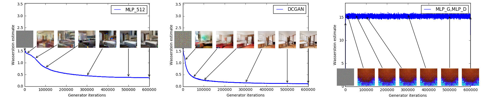
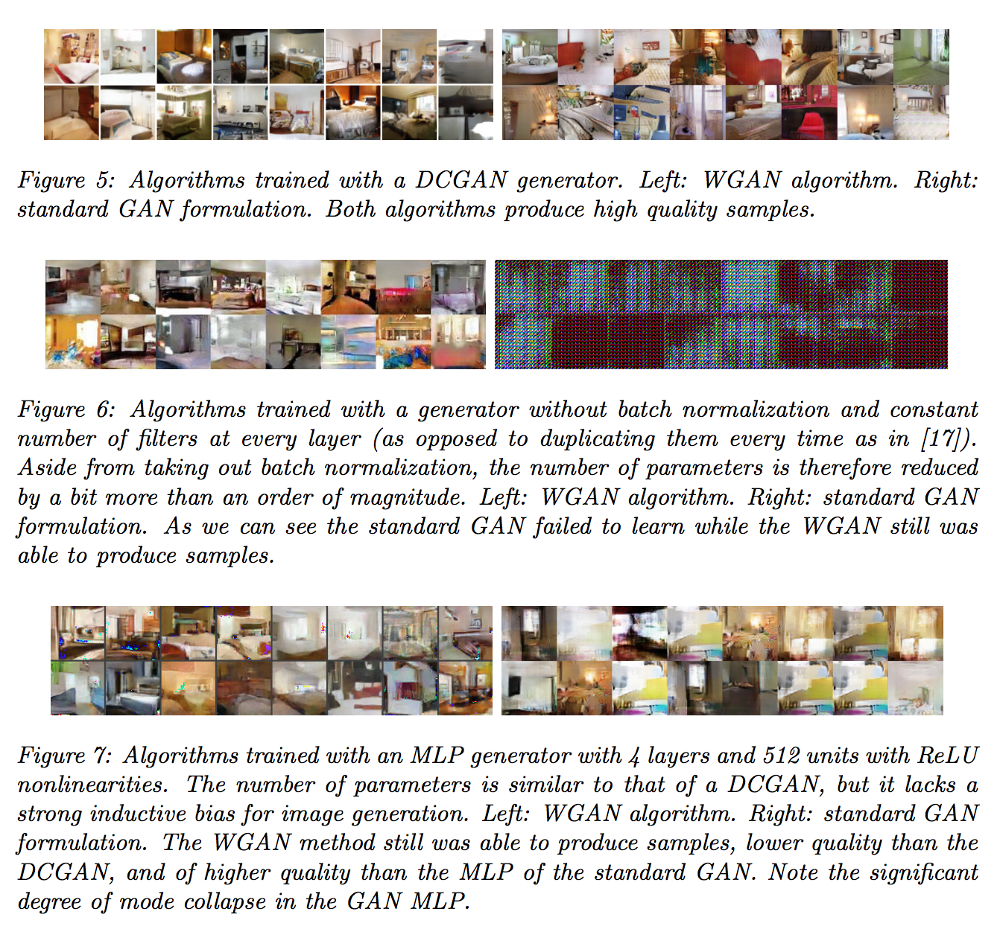

Wasserstein GAN
===============

Code accompanying the paper ["Wasserstein GAN"](https://arxiv.org/abs/1701.07875)

##Prerequisites

- Computer with Linux or OSX
- [PyTorch](http://pytorch.org)
- For training, an NVIDIA GPU is strongly recommended for speed. CPU is supported but training is very slow.

Two main empirical claims:

###Generator sample quality correlates with discriminator loss



###Improved model stability




##Reproducing LSUN experiments

**With DCGAN:**

```bash
python main.py --dataset lsun --dataroot [lsun-train-folder] --cuda
```

**With MLP:**

```bash
python main.py --mlp_G --ngf 512
```

Generated samples will be in the `samples` folder.

If you plot the value `-Loss_D`, then you can reproduce the curves from the paper. The curves from the paper (as mentioned in the paper) have a median filter applied to them:

```python
med_filtered_loss = scipy.signal.medfilt(-Loss_D, dtype='float64'), 101)
```

More improved README in the works.
